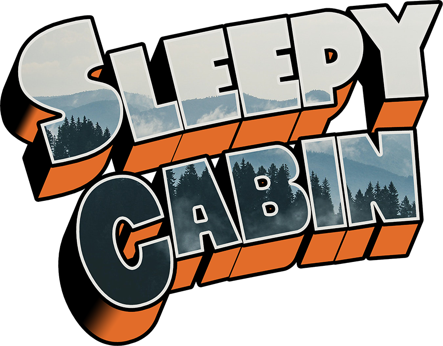

# Sleepy Cabin

# Demo
Link: https://adamtopczewski.github.io/sleepy-cabin/*

# About
Simple reservation website made in react using create-react-app.
Inspiration was my old job, where I used to work with hotel database.
This project is a practice in design,~~animations,~~ routing and working with mock data. 
Also used to learn basics of react.

Since this is a fictional business all the social links, addresses, and contact information are fake.
Backend is mocked using static data.

# Technologies
- ReactJS
- React Router
- HTML
- CSS

# Things to be done 
- adding booking functionality
- adding animations
- mock check-out
- reworking css
- optimization *mainly images*

# Credits

Logo design based on: https://youtu.be/Gp-CIB7kfxg

